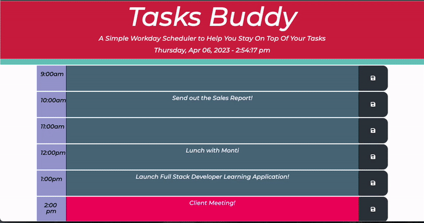

# Tasks Buddy

## Table of Contents

- [Description](#description)
- [User Story](#user-story)
- [Acceptance Criteria](#acceptance-criteria)
- [Images](#images) 
- [Link To Deployed Webpage on GitHub](#link-url-to-deployed-webpage-on-github)
- [Installation](#installation)
- [Technologies Used](#technologies-used)
- [Third Party APIs](#third-party-apis)
- [Credits](#credits)
- [License](#license)

## Description

The goal of this web application was to use the skills we learned with Third Party APIs to create a Workday Scheduler. The user will be able to log their task(s) into the alotted time slots for the current day. Time slots are colour coded. All past time slot hour will turn greyish/blue, a current time slot that is present will turn hot pink and future time slots will be a a mint colour. 

## User Story
- AS AN employee with a busy schedule
- I WANT to add important events to a daily planner
- SO THAT I can manage my time effectively

## Acceptance Criteria
- GIVEN I am using a daily planner to create a schedule
- WHEN I open the planner
- THEN the current day is displayed at the top of the calendar
- WHEN I scroll down
- THEN I am presented with time blocks for standard business hours
- WHEN I view the time blocks for that day
- THEN each time block is color-coded to indicate whether it is in the past, present, or future
- WHEN I click into a time block
- THEN I can enter an event
- WHEN I click the save button for that time block
- THEN the text for that event is saved in local storage
- WHEN I refresh the page
- THEN the saved events persist

## Images

## Link URL to deployed webpage on GitHub
https://cynthiamory.github.io/tasks-buddy/

## Installation

N/A

## Technologies Used
Assignment was built with:
- HTML5
- Advanced CSS
- JavaScript
- JQuery
- Bootstrap
- VS Code
- Github

## Third Party APIs 
- https://releases.jquery.com/
- https://cdnjs.com/
- https://momentjs.com/
- https://fontawesome.com/
- https://getbootstrap.com/

## Credits
- Webpage by: Cynthia Morales - Full Stack Developer Student
- Code Snippets Resource for work images: W3 Schools, StackOverflow, Reddit, CodePen. 
- Institution: The University Of Toronto
- Course: Bootcamp Full Stack Development
- Instructor: Ali Masqood
- Tutor: Jose Lopez
- Student Peer Help: Sunday Study Group.

## License

N/A